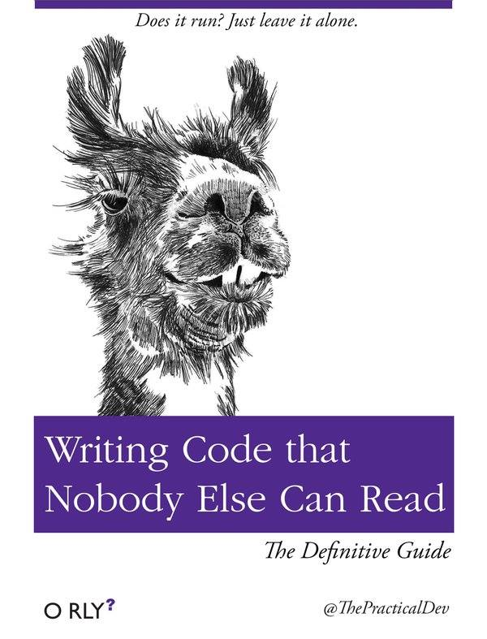

```{r setup, include=FALSE}
knitr::opts_chunk$set(echo = FALSE)
```

## Wait, but why? {.flexbox .vcenter}

<div class="columns-2">
  

  Poorly written code is **more costly** in the long-run

  - more time to understand
  - more time to debug
  - more time to fix
  - more time to migrate
  - more time to test
</div>

## Writing code is reading code

> “Indeed, the ratio of time spent reading versus writing is well over 10 to 1. We are constantly reading old code as part of the effort to write new code. ...[Therefore,] making it easy to read makes it easier to write.”
>
> -- <cite>Robert C. Martin | Clean Code (p. 14)</cite>

<br>
<br>
<br>
<br>
<br>

*_So... be kind to your future self, and make your code easier to read._*

## Reading as a skill

Reading is a universal, trainable skill.  Reading code is no exception.  

- Elementary Reading
    - _"Do I understand the syntax of this line of code?"_
- Inspectional Reading
    - _"If skim this file, do I understand what it is trying to do?"_
- Analytical Reading
    - _"What is this application trying to do?"_
- Syntopical Reading
    - _"What are these applications trying to do as a whole?"_
    
    
## Naming things is hard  {.flexbox .vcenter}

<blockquote class="twitter-tweet" data-lang="en"><p lang="en" dir="ltr">There are 2 hard problems in computer science: cache invalidation, naming things, and off-by-1 errors.</p>&mdash; Leon Bambrick (@secretGeek) <a href="https://twitter.com/secretGeek/status/7269997868?ref_src=twsrc%5Etfw">January 1, 2010</a></blockquote>
<script async src="https://platform.twitter.com/widgets.js" charset="utf-8"></script>

## Naming Things

Explain with example, Exercise, repeat.

- Reveal Intent
- Don't mislead the reader
- Make meaningful distinctions
- Use searchable names
- Avoid Encodings
- Don't be cute
- One word, one concept
- Use domain concepts

## Naming Things: tl;dr
