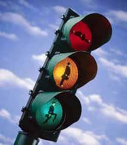
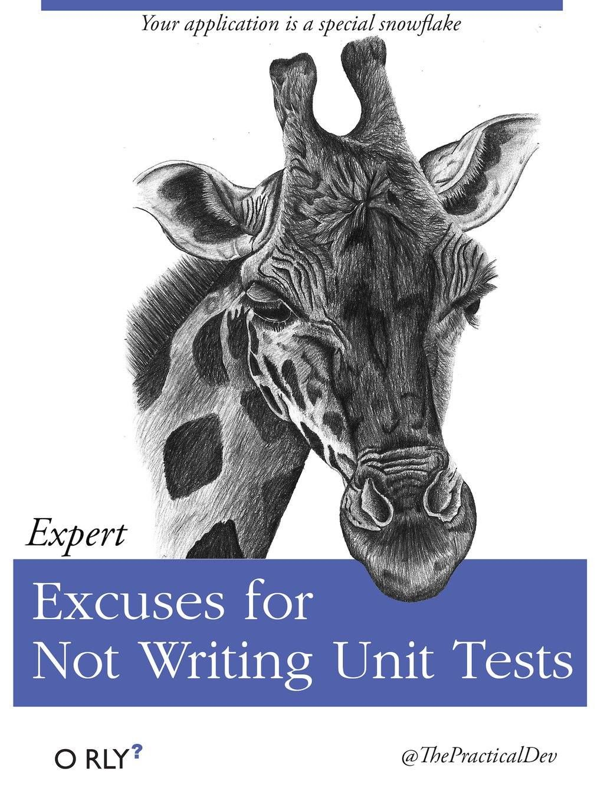
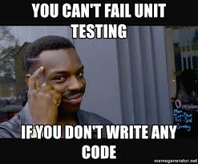

```{r setup, include=FALSE}
knitr::opts_chunk$set(echo = FALSE)
```

## That might work... {.flexbox .vcenter}


## Functional Testing

### **Purpose:** <br>

Validate software _**actions**_. 

- i.e., Does my code do what I think it should?

### Some types of functional testing include: <br>

- Unit          (We are going to focus here...)
- Integration
- Regression
- Acceptance

## Non-Functional Testing

### **Purpose:** <br>

Validate software _**performance**_. 

- i.e., Can my code handle the real world?

### Some types of non-functional testing include: <br>

- Load
- Performance
- Stress
- Security
- Usability

## Unit Tests
  
A unit test is a method that instantiates a small portion of our application and verifies its behavior **independently from other parts**.

## A trivial example in R

```{r, echo = TRUE, eval = FALSE}
library(testthat)

my_sum <- function(...) {
  numbers <- list(...)
  total = 0
  for (number in numbers){
    total = total + number
  }
  return(total)
}

testthat::test_that("`sum` adds numbers like it should...", {
  testthat::expect_true(my_sum(1, 2, 3) == 6)
})

```

## Now for python

```{python, echo = TRUE, eval = FALSE, python.reticulate = FALSE}
import unittest

def sum(arg):
    total = 0
    for val in arg:
        total += val
    return total

class TestSum(unittest.TestCase):
    def test_list_int(self):
        data = [1, 2, 3]
        result = sum(data)
        self.assertEqual(result, 6)

if __name__ == '__main__':
    unittest.main()
```

## Test Driven Development: What? {.flexbox .vcenter}

<div class="columns-2">
  


  Test Driven Development (TDD) is a development and testing practice characterized by a set of steps: <br>
  
  - Write a test
  - Write some code and make the test pass
  - Repeat
  
  <br> _a.k.a. “Red – Green – Refactor”._
</div>

## TDD, Why? {.flexbox .vcenter}

<div class="columns-2">
  


  - Encourages smaller, reusable functions
  - Forces consideration of edge cases
  - Assurance that small components meet expectations
  - Makes your intent for the function very explicit
  - Helps ensure refactoring doesn't break anything
  
</div>

## Laws of TDD

1. You may not write production code until you have written a failing unit test.
<br><br>
2. You may not write more of a unit test than is sufficient to fail, and not compiling is failing.
<br><br>
3. You may not write more production code than is sufficient to pass the currently failing test. 

## Limitations of TDD


## Now, a demonstration

  


## Clean Tests: Test one thing.

```{r, echo = TRUE, eval = FALSE}
# bad, the first failure prevents the evaluation of the next assertion
testthat::test_that("Check multiple things", {
  testthat::expect_true(my_sum(1, 2, 3) == 6)
  testthat::expect_true(my_sum(NA, NULL, 3) == 3)
})

# good, independent assertions let us hone in on the problem
testthat::test_that("Check one thing", {
  testthat::expect_true(my_sum(1, 2, 3) == 6)
})
testthat::test_that("Check the other thing", {
  testthat::expect_true(my_sum(NA, NULL, 3) == 3)
})
```

## Clean Tests: F.I.R.S.T.

- Fast    
    - Run quickly, let us know we are failing right away...
- Independent
    - Each test should run on its own.
- Repeatable
    - Tests should be able to be run in every environment
    - **Ideally as a part of the regular build process**
- Self-Validating
    - Make it a boolean output, don't make your reader jump to understand failures
- Timely
    - Write tests when you need them, design a function and write tests for that function

## Edge Cases (i.e., points of inflection)

```{r, echo = TRUE, eval = TRUE}
absolute_value = function(x) {
  if (x < 0) { x = -x }
  return(x)
}
```

```{r, echo = FALSE, eval = TRUE, fig.height=3}
x = seq(from = -10, to = 10)
y = mapply(absolute_value, x)
ggplot2::ggplot(data.frame(x = x, y = y) ) + ggplot2::geom_line(ggplot2::aes(x = x, y = y))
```
<br> 

- Where do we expect the behavior to change?
- What might be our appropriate points to test?

## Edge Cases, a simple example.

Find your edge cases, test on both sides...

```{r, eval = FALSE, echo = TRUE}
testthat::expect_true("Check behavior at zero", {
  testthat::expect_true(absolute_value(0) == 0)
})

testthat::expect_true("Check behavior below zero", {
  input <- -0.000000001
  testthat::expect_true(absolute_value(input) == -input)
})

testthat::expect_true("Check behavior above zero", {
  input <- 0.000000001
  testthat::expect_true(absolute_value(input) == input)
})
```

## Exceptions as expected behavior

"Expected behavior" shouldn't be limited to the positive use-case.  Consider the following scenario where we have added additional checks on our function inputs:

```{r, echo = TRUE, eval = FALSE}
absolute_value = function(x){
  if (is.null(x) || is.na(x)){
    stop("x must not be NULL, or NA.")    
  }
  if (!is.numeric(x)) {
    stop("x must be numeric")
  }
  if (x < 0) { x = -x }
  return(x)
}
```

- What additional test cases would we consider for **`full`** test coverage?

## Testing Exceptions

```{r, echo = TRUE, eval = FALSE}
testthat::test_that("Check behavior NA", {
  testthat::expect_error(absolute_value(NA))
})

testthat::test_that("Check behavior NULL", {
  testthat::expect_error(absolute_value(NULL))
})

testthat::test_that("Check behavior NULL", {
  testthat::expect_error(absolute_value("12"))
})

```

- How could we more specific with these tests?
- How might these types of checks change in a strongly typed language?
